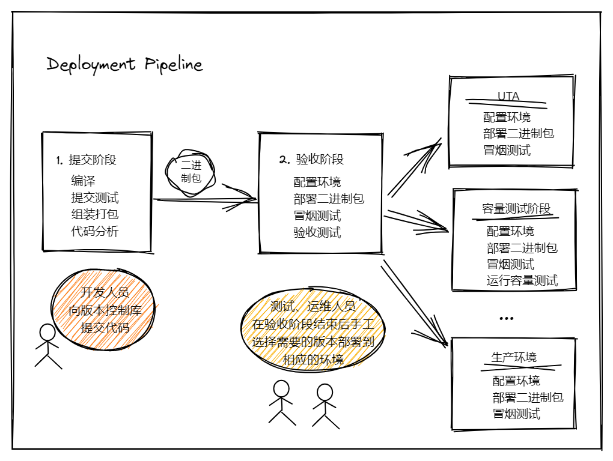
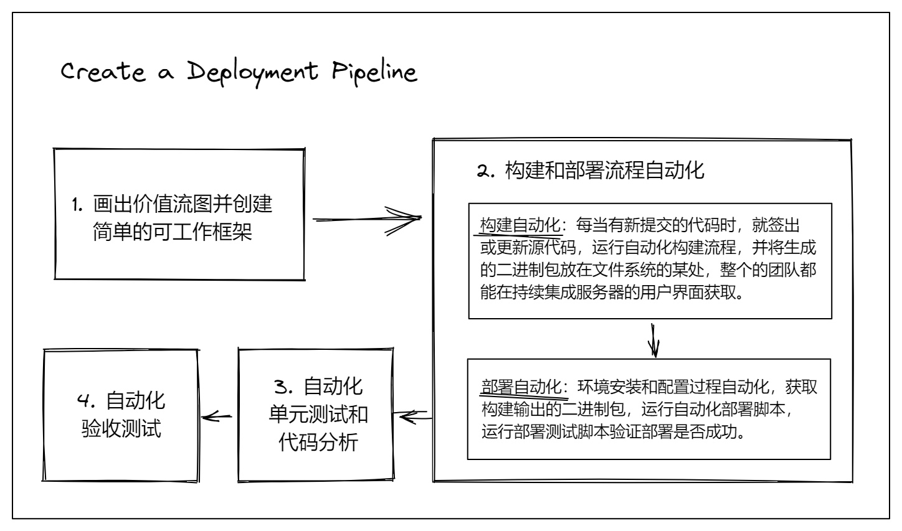

## 第二部分： 实现部署流水线
### 第五章：部署流水线解析
#### 对部署流水线的理解
- 持续集成：能够提供快速的反馈，确保软件正常工作，关注于软件是否编译成功以及通过单元测试，验收测试  
- 持续集成的输出作为后续手工测试流程和发布流程的输入
- 端到端的方式交付软件，端到端的构建，部署，测试，发布流程
- 测试团队一键将某个特定的软件版本部署到测试环境
- 运维人员一键将软件部署到试运行环境和生产环境
- 开发人员能看到每个目标环境上部署了哪个版本，发现了哪些问题
- 管理人员能看到周期时间、吞吐量、代码质量等关键指标
#### 本章的内容
- 什么是部署流水线
- 部署流水线的相关实践
- 提交阶段
- 自动化验收测试
- 后续测试

#### 2. 什么是部署流水线
- 部署流水线是对软件从版本控制系统到用户手中的过程的建模。   
- 部署流水线支持查看并控制变更从被提交到版本控制库开始，直到通过各类测试，部署，再到发布给用户的过程。
- 部署流水线的输入是版本控制系统中的某个具体版本。每次变更都会生成一次构建，此构建通过一系列测试，成为到达生产环境的发布版本
- 目的：在流水线中尽早发现不满足发布条件的构建版本，并尽快将失败原因反馈给团队。  
- 优势：阻止未充分测试的版本进入生产环境；快速可重复，且能够快速回滚
- 要求：将测试集合自动化； 将测试环境、试运行环境、生产环境上的部署过程自动化
- **部署流水线的阶段**
  - **提交阶段**：进行编译，自动化测试（单元测试）， 技术角度上判断整个系统是可以工作的
  - **自动化验收测试阶段**：从功能和非功能角度判断系统可工作， 满足用户需求，符合客户需求规范
  - **手工测试阶段**：探索性测试、集成环境上的测试、用户验收测试，判断系统是可用的
  - **发布阶段**： 以套装软件的方式或者部署到生产环境的方式将软件交付给用户
  
    
#### 3. 部署流水线的相关实践  
- 二进制包只在构建流水线的提交阶段生成一次
- 在各种环境中使用相同流程对软件进行部署  
- 部署时做冒烟测试
- 尽可能在生产环境相似的环境精选测试和持续集成
- 每次变更都应触发流水线
- 只要失败就停止流水线

#### 4. 提交阶段
- 如果提交阶段的测试通过了，这个版本就被视为一个候选发布版本。
- 提交阶段的目标是消除不适合生产环境的构建
- 内容
  - 编译代码
  - 运行提交测试集合（包括单元测试及部分关键测试）
  - 代码分析
  - 创建二进制包
  
#### 5. 自动化验收测试
- 提交测试大部分是单元测试，只反馈代码问题，需要在类生产环境中执行验收测试，判断程序是否能够部署并运行，是否符合客户规范。
- 验收测试阶段运行的大部分测试是功能测试
- 验收测试是回归测试套件，验证新的修改是否是否在现有功能中引入回归缺陷。
- 通过验收测试的构建版本才能作为流水线下一步的输入。  

#### 6. 后续测试阶段
- 对很多系统而言， 虽然有全面的自动化测试，但发布前任然需要手工测试
- 很多项目还需要在不同环境做与其它系统的集成测试
- 容量测试环境、探索性测试环境、试运行环境、生产环境，每个环节都有特定的配置信息
- 让测试人员根据自己的需求将任意一个版本部署到自己的测试环境
- 内容
  - 手工测试：探索性测试、易用性测试、演示
  - 非功能测试：容量测试、安全测试
  
#### 7. 发布准备
- 将发布环节视为部署流水线的自然结果
- 发布的过程简单到选择需要发布的版本，点击一下按钮
- 内容：
  - 自动化部署与发布
  - 变更撤销
#### 8. 实现一个部署流水线

- 部署流水线会随着项目的扩大增加组件与分支
- 从部署流水线中的数据可发现瓶颈

#### 9. 度量
- 对软件交付流程最重要的全局度量指标：周期时间
- 其他度量项：

